---
output:
  xaringan::moon_reader:
    css: ["default", "style.css", 'metropolis-fonts']
    lib_dir: libs
    nature:
      highlightStyle: github
      highlightLines: true
      countIncrementalSlides: false
      seal: false
---

```{r setup, include=FALSE}
options(htmltools.dir.version = FALSE)
```

class: inverse, center, top

<div class="my-logo-left"></div>
<div class="my-logo-right"></div>
<br /> 
<br />
<br /><br />
<br />
<br />
<br />
# .small[Functional traits and phylogeny]

<br />

#### .large[Aurele Toussaint]

#### .large[Autumn 2020]

---
class: inverse, left, top
### Functional traits and phylogeny
<br />
<font size="5">
- _Functional trait_: **"any morphological, physiological or phenological feature measurable at the individual level."** (Violle et al., 2007)

- _Phylogeny_: relationships among organisms and their evolutionary development  

--
<br />
<br />
- Combining _Functional trait_ and _Phylogeny_ allows to investigate if closely related species (in the phylogeny) tend to share more similar traits than not related species

</font size>

---
class: inverse, left, top
### Functional space
- <font size="5">Functional space of the plants and mammals.</font size>

```{r echo=FALSE,fig.align='center'}
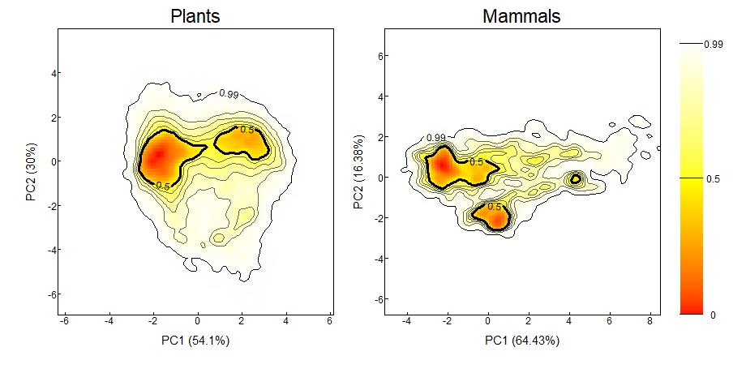
```
.right[Carmona et al. 2020 *BioRxiv*]

---
class: inverse, left, top
### Functional space
- <font size="5">Internal organization of the functional space. </font size>
<br/>

```{r echo=FALSE,fig.align='center'}
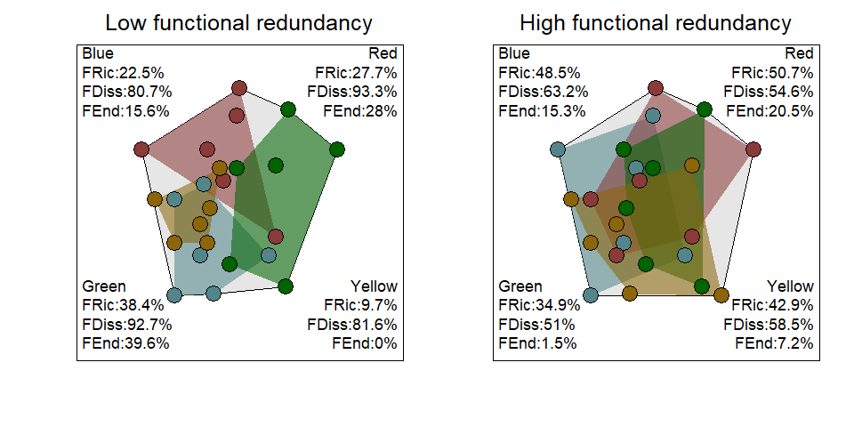
```
<br/>

--

- 'Clades' occupy a unique/redundant functional space between each other

---
class: inverse, left, top
### Evolution of the traits
- <font size="5">From the functional space to the phylogenetic tree. </font size>

```{r, echo=F,warning=FALSE, animation.hook="gifski", message=FALSE, out.height= "60%", out.width="60%",fig.align='center'}
library(phytools)
for (i in 1:3){
  tree<-pbtree(n=15)
  X<-fastBM(tree,nsim=2)
  project.phylomorphospace(tree,X, nsteps=3, sleep=0,direction=c("from"), axes=FALSE,xlab=" ",ylab=" ")
}
```

---
class: inverse, left, top
### Phylogenetic signal across each functional trait
- "Statistical dependence among observations for species related by a phylogenetic tree" (Revel 2008)

--

- <font size="5">Pagel's transformation</font size>
<br />
```{r echo=FALSE,fig.align='center',out.height= "85%", out.width="85%"}
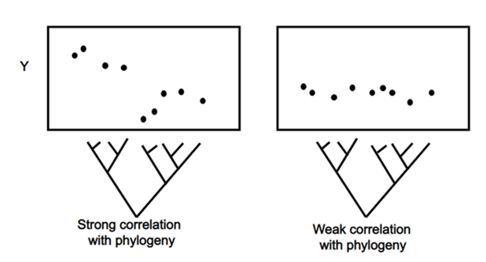
```

<font size="5">Range from 0: No signal to 1: Perfect signal</font size>

---
class: inverse, left, top
### Fit an evolutionary model to detect potential signal
<center><font size = 6>fitContinuous {geiger}</font></center>
<br>
- Model *Lambda*: 
<br><br>
```{r echo=FALSE,fig.align='center'}
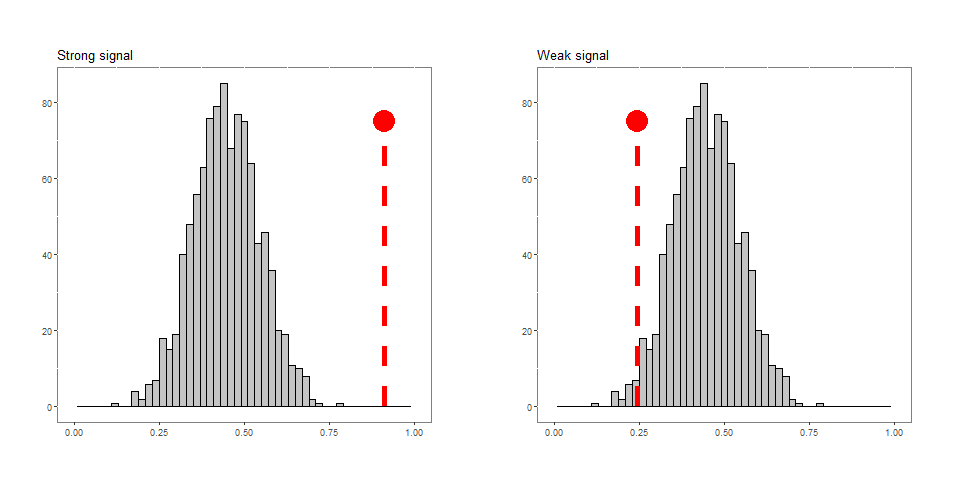
```

---
class: inverse, left, top
### Phylogenetic signal across each functional trait
<center><font size = 5>For the six taxonomic groups and their traits</font></center>
<br>
```{r echo=FALSE,fig.align='center'}
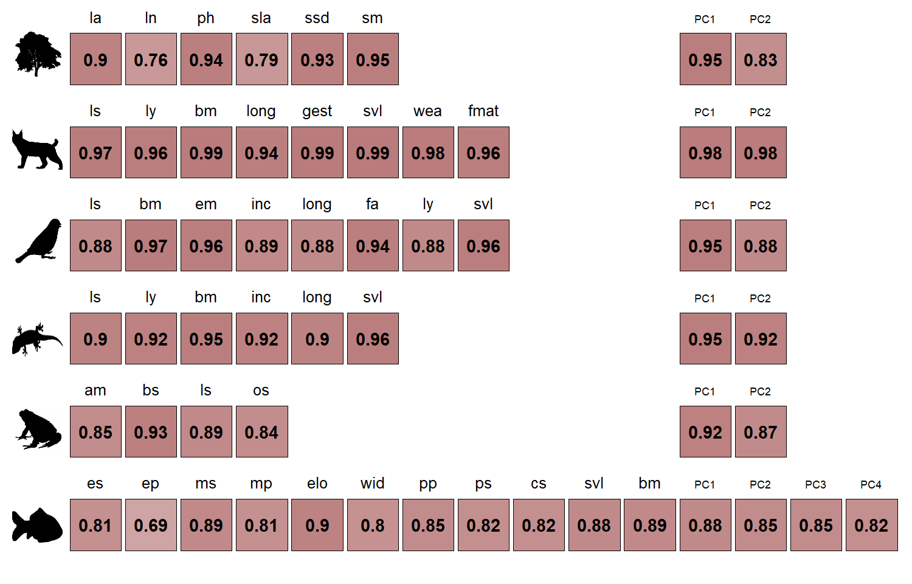
```

---
class: inverse, left, top
### Internal organization of the functional space
<br />
- 'Clades' occupy a unique/redundant functional space between each other
<br />
```{r echo=FALSE,fig.align='center'}
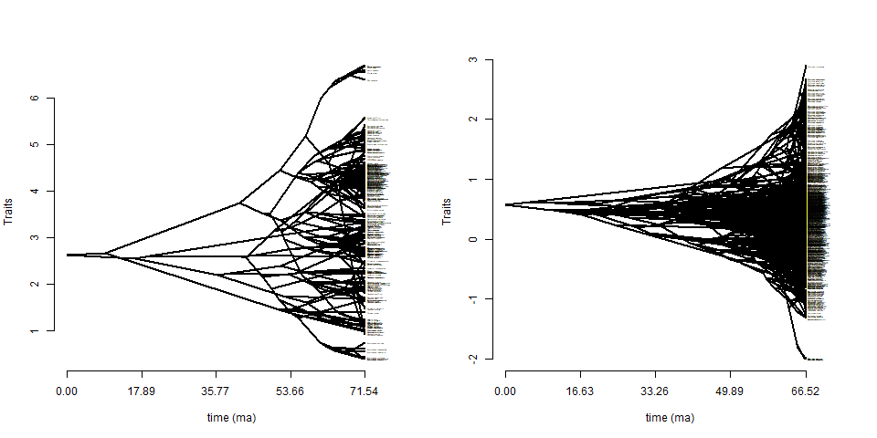
```
<br>

---
class: inverse, left, top
### Internal organization of the functional space
<br />
- 'Clades' occupy a unique/redundant functional space between each other
<br />
```{r echo=FALSE,fig.align='center'}
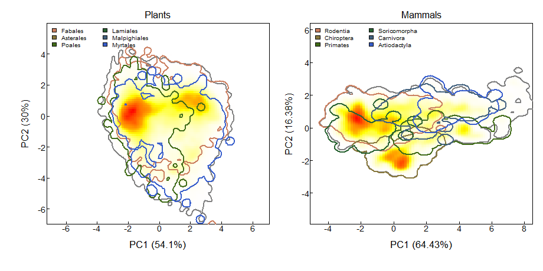
```

---
class: inverse, left, top
### Functional space
- Compare the FRic of each order to random FRic
  - Randomizations: species are sorting within the whole pool of species  
    
- For different clades:  

    - Order
    - Family
    - Genus

```{r echo=FALSE,fig.align='right',out.height= "75%", out.width="75%"}

```


---
class: inverse, left, top
### FRic vs Null Model across Clades
ORDER - FAMILY - GENUS     
<br>
```{r echo=FALSE,fig.align='center'}
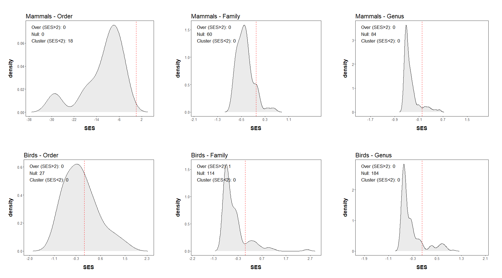
```
<br>


---
class: inverse, left, top
### FRic vs Null Model across Clades
ORDER - FAMILY - GENUS   
<br>
```{r echo=FALSE,fig.align='center', out.width='60%', out.height='\\textheight'}
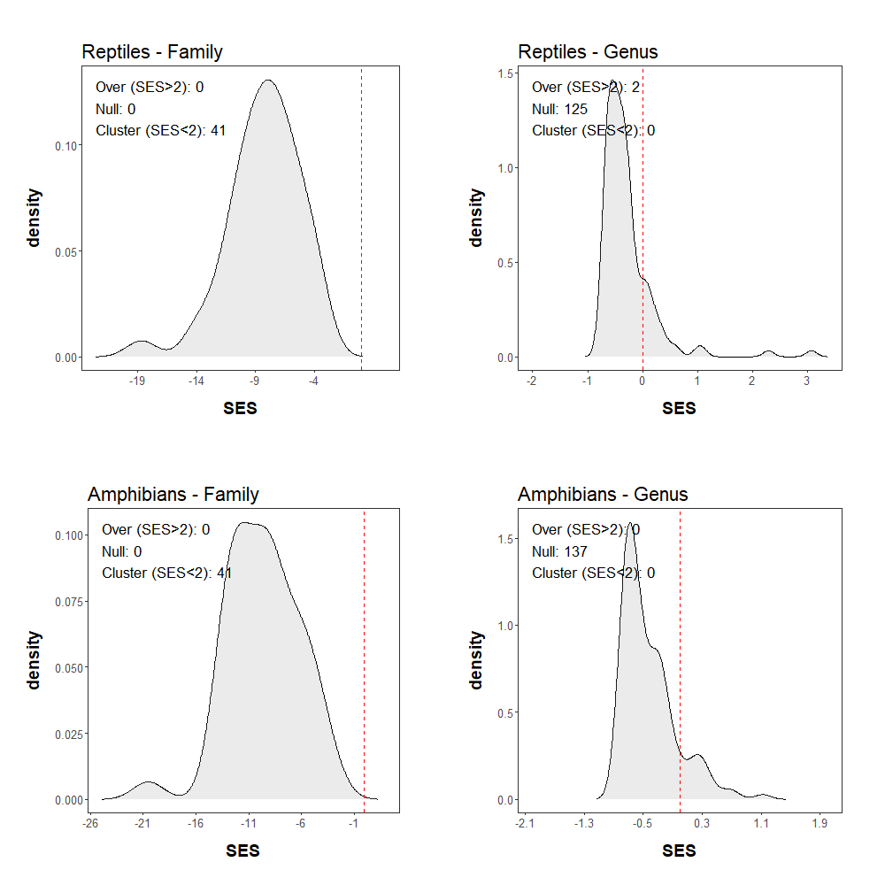
```
<br>

---
class: inverse, left, top
### Example of freshwater fishes
<br />
Freshwater fishes
```{r echo=FALSE,fig.align='center'}
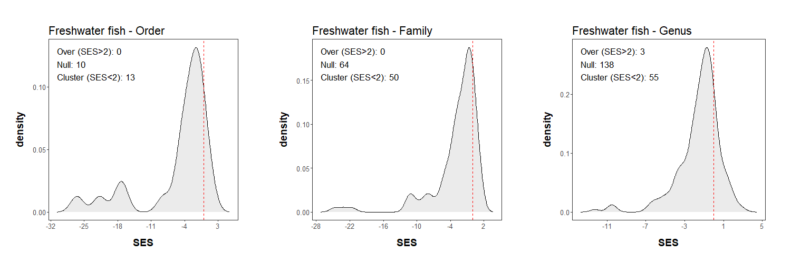
```
<br>
  
---
class: inverse, left, top
### Phylogenetic distance vs functional distance
<br />

```{r echo=FALSE,fig.align='center'}
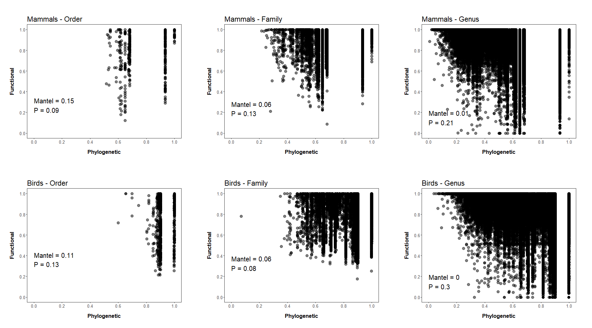
```
<br>
 
---
class: inverse, left, top
### Phylogenetic distance vs functional distance
<br />

```{r echo=FALSE,fig.align='center', out.width='60%', out.height='\\textheight'}
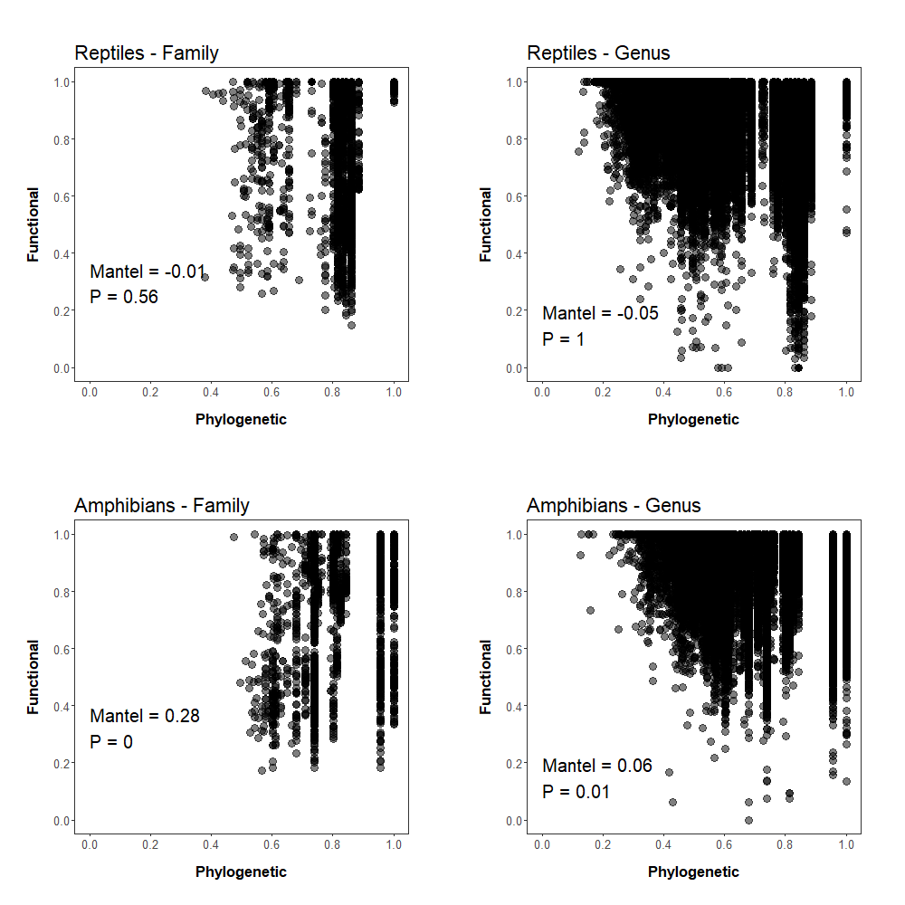
```
<br>

---
class: inverse, left, top
### Phylogenetic distance vs functional distance
<br />

```{r echo=FALSE,fig.align='center'}
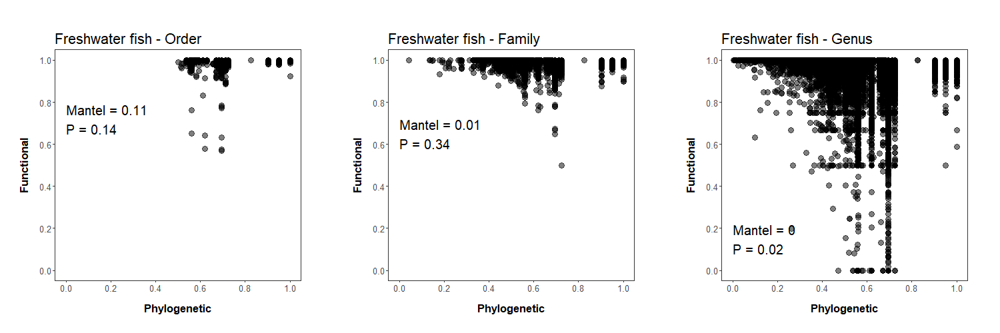
```
<br>

---
class: inverse, left, top
### Comparing rates of phenotypic evolution

<div class="row">
  <div class="left-column">
  </div>
  <div class="right-column">
```{r echo=FALSE,out.height= "100%", out.width="100%"}
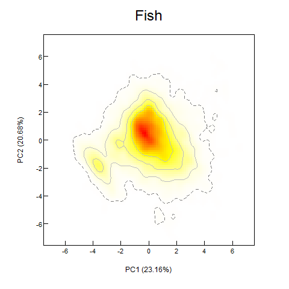
```
  </div>
</div>

---
class: inverse, left, top
### Comparing rates of phenotypic evolution

<div class="row">
  <div class="left-column">
      <p>Functional traits can evolved differently within clade</p>
  </div>
  <div class="right-column">
```{r echo=FALSE,fig.align='center',out.height= "100%", out.width="100%"}
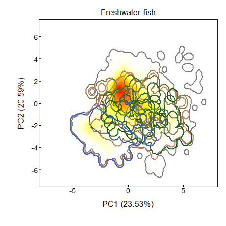
```
  </div>
</div>

---
class: inverse, left, top
### Functional traits can evolved differently __between__ regions

- Example 1. *Siluriforms*
  
```{r, echo=F,fig.align='center',out.height= "50%", out.width="50%"}
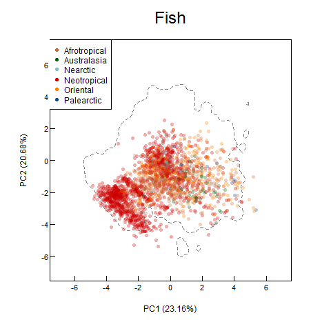
```

---
class: inverse, left, top
### Identification of the shifts
<div class="row">
  <div class="left-column">
  <h4>MCMC model: </h4>
    <p>- 100,000 generations </p>
    <p>- First 20% burned </p>
    <p>- Convergence OK </p>
    <p>- Mean on 3 MCMC chains </p>
  </div>
  <div class="right-column">
```{r echo=FALSE,fig.align='right'}
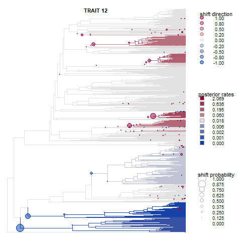
```
  </div>
</div>

---
class: inverse, left, top
### Identification of the shifts for the 15 traits of the Siluriforms
  
```{r, echo=F,fig.align='center'}
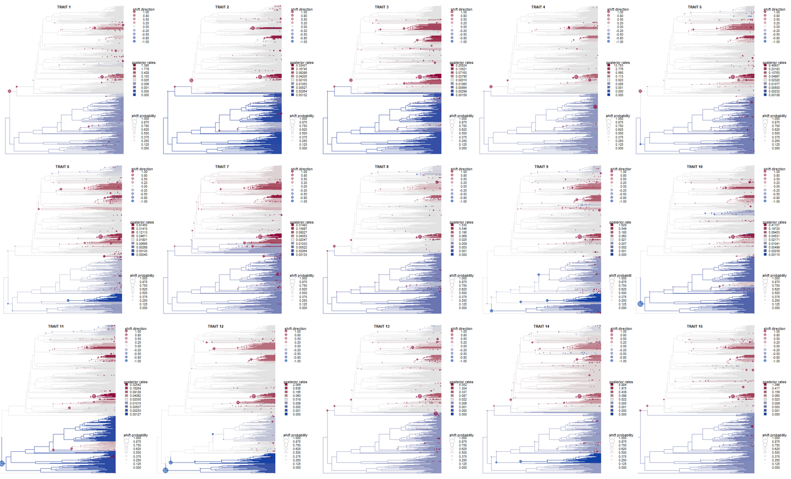
```


---
class: inverse, left, top
### Evolution of the Neotropical species traits compared to the background evolution
<br />
Example for the **Siluriforms**  
```{r echo=FALSE,fig.align='center',out.height= "40%", out.width="50%"}
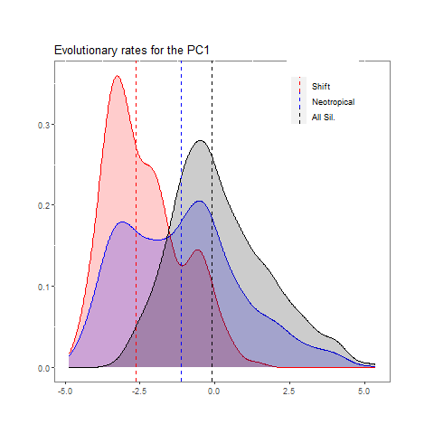
```
<center>The shifts DO NOT match with geographic divergences</center>

---
class: inverse, left, top
### Conclusion
- The functional traits are phylogenetically conserved  

--

- Among taxonomic groups, the evolution of functional trait diverged:

--

  - Mammals: Orders strongly diverge between each other but not Family/Genus
  - Birds: Clades are not functionnally clustered but some clades are clustered  
  - Reptiles/Amphibians: Not clustered
  - Fishes: Order/Family/Genus are clustered

--

- The phylogeny allows to detect complicated evolution patterns of traits

--

  - Identified shifts in traits evolution along the phylogeny
  - Correlation between divergence between regions
